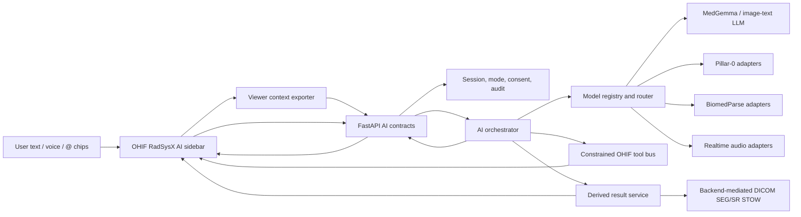

# RadSysX AI Backend And Agentic Imaging Roadmap

Last updated: 2026-06-13
Status: planning artifact; no runtime implementation is completed by this file.
Primary experiment environment: Ubuntu 24.04 NVIDIA L40S VM, documented in `roadmap/ai-backend/GPU_EVAL_LOG.md`.

## Read This First

This file is the durable brain-extension plan for turning the current frontend-only RadSysX AI sidebar into a real backend-driven multimodal imaging assistant.

Related research:

- `roadmap/ai-backend/REALTIME_VOICE_RESEARCH.md` distills an external GPT 5.5 Pro research pass on the realtime voice/chat architecture. Treat it as the source of record for the current transport split: HTTP POST for durable writes, SSE for ordinary chat/job/tool events, WebSocket for local ASR audio, provider-native WebRTC for OpenAI Realtime, and provider/stateful WSS for Gemini Live.
- `roadmap/ai-backend/GPU_EVAL_LOG.md` records the GPU VM bring-up, CUDA/PyTorch validation, RadSysX desktop build checks, Hugging Face access probes, Nemotron ASR smokes, MedGemma 1.5 4B BF16 smokes, Sybil-1.5/Pillar0-ChestCT example inference, and BiomedParse v2 CT segmentation inference on an NVIDIA L40S.

Current baseline:

- The Electron fast path opens directly into OHIF local DICOM mode at `/viewer/local`.
- The visible app name is `RadSysX`.
- The OHIF right sidebar has a RadSysX AI panel with local chat state, text composer, voice affordance, and `@` chips for ROI, segmentation, and measurement context.
- The AI panel is intentionally frontend-only today. It does not call backend AI endpoints, does not persist clinical chat state, and does not execute model inference.
- A first BioMedParse integration demo now exists behind `RADSYSX_BIOMEDPARSE_DEMO_ENABLED=1`: the backend exposes session-protected capability/run/artifact routes, the worklist shows an optional demo panel, and a subprocess worker runs the bundled CT AMOS sample without importing CUDA/Detectron2 into the FastAPI process. The runbook lives at `roadmap/ai-backend/BIOMEDPARSE_DEMO.md`.
- Existing clinical rules still apply: governed workflows must use backend-issued actor context, opaque launch sessions, audit events, backend-mediated AI jobs, and backend-mediated derived DICOM writeback.
- RadSysX is an Electron desktop app and should remain cross-platform. Linux/NVIDIA is the first validation lane for heavy local model and ASR experiments, not a product boundary.

North star:

- Open the local RadSysX desktop app, load imaging, talk or type naturally, and have an AI assistant that can recognize, segment, annotate, explain, measure, report, and operate the viewer through safe, auditable tools.
- Prefer local, open, inspectable models when they improve privacy, cost, control, offline use, or reproducibility. Do not treat APIs as inherently bad: a governed hospital-grade API path with contractual safeguards, explicit enablement, audit, retention controls, and user review can be a legitimate production lane.
- Keep the result almost fully open-source, useful for research and education first, and engineered so clinical hardening can happen without rewriting the core architecture.

Do not forget:

- First GPU evaluation happened on 2026-06-12 and is recorded in `roadmap/ai-backend/GPU_EVAL_LOG.md`. Treat it as the baseline evidence for the NVIDIA/Linux worker lane, not as a completed backend implementation.
- Source facts below are snapshots checked on 2026-06-12. Revalidate before implementation.
- BiomedParse is not MIT. Treat the GitHub code license, Hugging Face model license, checkpoint terms, and research/clinical-use restrictions as separate checks before packaging or distribution.
- Pillar-0, Sybil, RAVE, and related YalaLab repositories/checkpoints also need artifact-by-artifact license checks. Do not assume one license covers the whole ecosystem.
- MedGemma and Pillar-0 model access may require accepting model terms on Hugging Face.
- Sybil-1.5 is a risk model for future lung cancer risk, not a generic lesion detector.
- RAVE is attractive because it is purpose-built to turn DICOM and NIfTI into ML-ready representations.
- Cross-platform hardware matters: NVIDIA/Linux is only one validation lane. Apple Silicon/Metal, Windows CUDA/DirectML, CPU/no-GPU fallback, and governed API deployment should all stay visible in the architecture.
- Nemotron 3.5 ASR loaded and transcribed on the L40S. The current NeMo convenience `transcribe()` path needed `RNNTPromptTranscribeConfig(use_lhotse=False, target_lang="en-US")` to avoid a prompt-language dataloader failure; NeMo's cache-aware streaming example also ran successfully through a manifest with `target_lang=en-US`.
- MedGemma 1.5 4B is the preferred first local image/text model lane after authenticated access. It loaded in BF16 and completed text plus synthetic-image smokes at about 8.1 GiB peak VRAM on the L40S.
- Sybil-1.5 and its Pillar0-ChestCT base model loaded through the official `pillar-finetune` example after gated access was fixed. The included one-row RVE example ran with `test_loss: 0.6579`; this remains a lung cancer risk-model experiment only.
- BiomedParse v2 ran the bundled 3D abdominal CT segmentation example on the L40S in a CUDA 13 aligned compatibility environment. It produced a `(63, 512, 512)` mask with labels `0..15` at about 8.279 GiB peak VRAM. The official CUDA 12.4 dependency lane failed at Detectron2 build time on this CUDA 13 VM, so BioMedParse belongs in an optional worker/container with explicit CUDA/PyTorch alignment.

## Source Snapshot

Checked on 2026-06-12 and 2026-06-13:

| Candidate | Role in RadSysX | Source facts to retain | License/access notes | Link |
| --- | --- | --- | --- | --- |
| MedGemma 1.5 4B | General medical image/text-to-text assistant and report/chat model | Multimodal image-text-to-text model, local GPU usage through Transformers, vLLM, SGLang, or Docker Model Runner; supports high-dimensional CT/MRI representations, WSI patches, longitudinal CXR, localization, documents, and EHR text | Governed by Google's Health AI Developer Foundations terms; gated access on Hugging Face; not optimized for multi-turn apps per model card, so validate chat behavior carefully | <https://huggingface.co/google/medgemma-1.5-4b-it> |
| Pillar-0 collection | Modality-specific radiology foundation model family | Collection includes Breast MRI, Head CT, Abdomen CT, Chest CT, and Sybil-1.5 entries | Verify each checkpoint/code license separately before download, packaging, or distribution | <https://huggingface.co/collections/YalaLab/pillar-0> |
| Pillar0-Sybil-1.5 | LDCT future lung cancer risk prediction | Fine-tuned from Pillar-0 Chest CT; predicts 1-6 year future lung cancer risk from a single low-dose CT | ECL-2.0; gated model access requiring contact info acceptance | <https://huggingface.co/YalaLab/Pillar0-Sybil-1.5> |
| RAVE | Imaging preprocessor and ML-ready conversion layer | High-performance engine for converting DICOM and NIfTI files into ML-ready formats with windowing and compression | ECL-2.0 in current repo | <https://github.com/YalaLab/rave> |
| BiomedParse v2 | Text-guided segmentation fallback and broad modality coverage | v2 supports end-to-end 3D inference for CT, MRI, Ultrasound, PET, and 3D microscopy; v1 is recommended by the repo for 2D modalities including CT, MRI, Ultrasound, X-Ray, Pathology, Endoscopy, Dermoscopy, Fundus, and OCT; L40S smoke succeeded on the included 3D CT example | Not MIT; Hugging Face model metadata reports `cc-by-nc-sa-4.0`; verify repo code, model card, checkpoint, data, noncommercial, share-alike, and research-only terms separately before use | <https://github.com/microsoft/BiomedParse> |
| Nemotron 3.5 ASR Streaming 0.6B | Local realtime speech-to-text candidate | 600M parameter streaming ASR using cache-aware FastConformer-RNNT; supports configurable chunk sizes from 80ms to 1120ms and many language locales | OpenMDW-1.1; NeMo/NVIDIA GPU worker likely validates on Linux first, while RadSysX remains cross-platform | <https://huggingface.co/nvidia/nemotron-3.5-asr-streaming-0.6b> |
| Gemini Live API / `gemini-3.1-flash-live-preview` | API realtime voice/vision/text option | Live API supports low-latency stateful WebSocket sessions, raw PCM audio, image/text input, audio output, tool use, transcripts, and barge-in | API service; use backend mediation or ephemeral tokens only where policy allows; synchronous tool behavior must route through RadSysX broker | <https://ai.google.dev/gemini-api/docs/live-api> |
| OpenAI Realtime / `gpt-realtime-2` | API speech-to-speech reasoning and tool-use option | Realtime 2 is documented as a reasoning voice model for low-latency speech-to-speech, stronger tool calling, long context, and controllable reasoning effort | API service; use backend-created/mediated WebRTC sessions where enabled; pricing and availability must be rechecked before integration | <https://developers.openai.com/api/docs/guides/realtime-models-prompting> |
| Ambient clinical documentation precedent | Production pattern for governed cloud/API voice in clinics and hospitals | Microsoft Dragon Copilot, Abridge, Nabla, and similar systems show that ambient listening and AI-generated clinical documentation can exist in real clinical environments when wrapped in consent, security, integration, retention, and clinician-review workflows | This supports a governed API lane, not browser-direct unmanaged PHI transfer | <https://www.microsoft.com/en-us/health-solutions/clinical-workflow/dragon-copilot> |

## Product Vision

The sidebar should become a clinical-grade interaction surface without losing the local-first magic:

- User loads local DICOM in OHIF.
- User asks by text or voice: "What am I looking at?", "segment the ventricles", "show me the largest lung nodule", "measure the lesion I just drew", "compare this ROI to prior", "draft a report impression", "open the next series", "switch to lung window", "attach this measurement to the chat".
- RadSysX gathers a safe viewer context snapshot: viewport, modality, series, frame/slice, measurements, segmentations, selected ROI, image thumbnails or derived tensors, and clinical mode.
- The backend routes the request to a model plan:
  - MedGemma or another image/text-to-text LLM for explanation, report drafting, and visual reasoning.
  - Pillar-0 modality models for fast, targeted radiology embeddings or predictions where available.
  - Pillar0-Sybil-1.5 for LDCT future lung cancer risk experiments and eventually governed risk workflows after validation.
  - BiomedParse for text-guided segmentation when Pillar-0 cannot do the requested modality/task or when robust 3D segmentation is needed.
  - Nemotron ASR for local dictation/voice commands where GPU resources allow.
  - Gemini Live or GPT-Realtime-2 for API-backed low-latency voice when local realtime is not practical.
- The assistant streams intermediate state back to the sidebar: transcript, intent, selected context, model job state, proposed actions, masks/ROIs, and final answer.
- UI control happens through a constrained OHIF command bus, not blind DOM automation.
- Any diagnosis-like output is labelled as AI assistance, grounded in cited image context, and separated from final clinician responsibility.

The experience should feel simple. The architecture underneath can be serious.

## Deployment Philosophy

RadSysX should be cross-platform and deployment-plural:

- Local-first means the app must be useful on one computer, with a no-Docker Electron fast path and a strong offline/local option.
- Local-first does not mean API-hostile. Hospitals already deploy ambient clinical documentation systems that listen to clinical encounters and draft notes in real workflows. The RadSysX equivalent should be possible when the deployment has consent, contractual safeguards, security review, retention policy, audit, and clinician review.
- Privacy is not guaranteed by "local" and not automatically destroyed by "API". Local machines can leak data; governed APIs can be acceptable. The deciding factor is policy, consent, data minimization, auditability, and the exact data path.
- No provider realtime session should own the RadSysX clinical record. Provider APIs can supply speech, transcription, reasoning, or draft suggestions; RadSysX still owns session authority, context snapshots, tool policy, approval, persistence, and audit.
- Heavy local AI should be optional by hardware lane, not a requirement for normal use.

Cross-platform hardware lanes:

| Lane | Purpose | Notes |
| --- | --- | --- |
| NVIDIA/Linux | First heavy-model validation lane for the next GPU run, especially Nemotron/NeMo, vLLM/SGLang, BiomedParse, and RAVE experiments | Important but not a product boundary |
| Apple Silicon/Metal | Primary local inference lane for many clinicians and researchers using M-series Macs | Evaluate MLX, PyTorch MPS, Core ML, llama.cpp/whisper.cpp-style runtimes, and provider realtime in packaged Electron |
| Windows CUDA/DirectML | Essential desktop lane for hospitals and radiology workstations | Evaluate CUDA where NVIDIA GPUs exist, DirectML/ONNX Runtime where appropriate, microphone permissions, device routing, and enterprise lockdown constraints |
| CPU/no-GPU | Accessibility and fallback lane | Must support text chat, API realtime, mock/local lightweight models, and no heavy bootstrap |
| Governed API | Production-quality voice/chat lane where allowed | Requires backend mediation, explicit enablement, BAA/DPA or equivalent, retention controls, PHI policy, and audit |

## Architecture Sketch



Core layers:

- UI layer: OHIF right sidebar, composer, voice controls, context chips, streaming state, action approvals, result previews.
- Context layer: read-only extraction of viewer state, selected measurements, segmentation metadata, thumbnails, current slice/volume coordinates, and safe identifiers.
- AI API layer: backend session, message, attachment, streaming, model job, tool-call, and audit contracts.
- Orchestration layer: model selection, prompt/context construction, tool-call policy, result normalization, safety checks, fallback routing.
- Model runtime layer: local GPU runners, external API adapters, model registry, health checks, hardware capability detection.
- Imaging preparation layer: DICOM/NIfTI conversion, RAVE exploration, NIfTI/NRRD handling, windowing, normalization, de-identification, tiling, 2D/3D tensor preparation.
- Derived result layer: ROI/mask/measurement conversion into OHIF-compatible annotations, DICOM SEG/SR, and future report attachments.

## Non-Negotiable Safety Rails

- Do not send PHI, DICOM metadata, raw DICOM bytes, patient identifiers, or launch tokens to external APIs in `pilot` or `clinical` unless an explicit governed consent/configuration path is designed.
- Do not let the browser be the source of clinical actor identity.
- Do not let the browser write derived clinical results directly to Orthanc or another archive.
- Do not let a model perform arbitrary computer-use actions. Use a whitelisted action schema backed by OHIF services/commands.
- Do not let model output silently become a report, diagnosis, order, or durable clinical result without user review and backend audit.
- Keep local research experiments clearly mode-gated.
- Keep model weights and generated PHI-bearing artifacts out of git.
- Treat every AI output as untrusted until validated, traceable, and reviewable.

## Runtime Mode Policy

Research mode:

- Can expose experimental model runners and faster UI iteration.
- Can use local study files, local GPU adapters, local ASR, and external API experiments if explicitly configured.
- Must still avoid committing PHI or credentials.

Pilot mode:

- AI features should be backend-mediated and auditable.
- External API use must default off, but may become a first-class governed deployment option when explicitly enabled by site policy, contractual safeguards, consent, and audit.
- Local model inference can be enabled behind explicit env flags and clear UI state.
- Derived masks/measurements can be previewed but need explicit user acceptance before persistence.

Clinical mode:

- Only governed backend AI contracts.
- No browser-direct unmanaged third-party AI calls.
- No external API calls without a formal consent, BAA/DPA or equivalent data-governance path, retention policy, operational configuration, and audit.
- Persisted report/SEG/SR/audit flows must go through backend services.
- Model disclaimers, validation status, and provenance must be visible and durable.

## Backend Contract Draft

Proposed endpoints:

- `GET /api/ai/capabilities`
  - Returns enabled providers, local GPU availability, model registry, max upload/context sizes, supported modalities, audio availability, and mode restrictions.
- `POST /api/ai/sessions`
  - Creates an AI chat/session bound to actor context, app mode, optional study UID, viewer launch session, and local-only consent state.
- `GET /api/ai/sessions/{sessionId}`
  - Returns session metadata, message history, model provenance, and current safety state.
- `POST /api/ai/sessions/{sessionId}/messages`
  - Adds a text message plus optional attachments/chips; returns an async turn ID.
- `GET /api/ai/sessions/{sessionId}/events`
  - Server-sent events for token deltas, transcript deltas, model job updates, tool proposals, result previews, and errors.
- `POST /api/ai/context/snapshots`
  - Stores a sanitized viewer context snapshot for a turn.
- `POST /api/ai/jobs`
  - Starts long-running model work such as 3D segmentation, risk prediction, volume preprocessing, or report drafting.
- `GET /api/ai/jobs/{jobId}`
  - Polls job state and result references.
- `POST /api/ai/tool-calls/{toolCallId}/approve`
  - User-approved execution of proposed viewer/UI actions or derived result persistence.
- `POST /api/ai/tool-calls/{toolCallId}/reject`
  - Records explicit rejection and optional reason.
- `POST /api/ai/audio/sessions`
  - Creates local or API-backed realtime audio session, with ephemeral external tokens where needed.
- `POST /api/ai/audio/sessions/{audioSessionId}/close`
  - Closes audio session and records transcript state.
- `POST /api/derived-results/stow`
  - Existing backend-mediated writeback path remains the durable DICOM SEG/SR persistence target.

Core DTOs to design:

- `AiSession`
- `AiMessage`
- `AiTurn`
- `AiAttachment`
- `ViewerContextSnapshot`
- `ImageContextReference`
- `MeasurementContextReference`
- `SegmentationContextReference`
- `RoiContextReference`
- `ModelCapability`
- `ModelRun`
- `ModelProvenance`
- `ToolCallProposal`
- `ToolCallApproval`
- `UiAction`
- `SegmentationResult`
- `RiskPredictionResult`
- `ReportDraftResult`
- `AudioSession`
- `AudioTranscriptEvent`
- `AiAuditEvent`

## Viewer Context Snapshot Draft

The viewer should send only what the backend needs:

- `studyInstanceUid` or local imported study reference, depending on route.
- `seriesInstanceUid`, `sopInstanceUid`, frame index, slice index, viewport ID.
- Modality, body part, orientation, window/level preset, active tool.
- Selected measurements with OHIF measurement IDs, geometry, labels, units, and display values.
- Selected segmentations with segmentation ID, representation type, segment labels, color, and visibility.
- User-selected ROI references with coordinates in image space and patient/volume space when available.
- Small derived preview images or tensors only when allowed by mode and config.
- Hashes or opaque references for PHI-bearing files rather than raw file paths where possible.
- A `privacyClass` flag describing whether the snapshot is local-only, de-identified, or PHI-bearing.

Do not include:

- Patient names in model prompts by default.
- Full DICOM tag dumps.
- Raw launch tokens.
- Absolute local file paths unless a local-only worker needs them and the path never leaves the host.

## `@` Attachment Semantics

The frontend already exposes `@` context chips conceptually. The backend should treat them as typed references:

- `@current-image`
  - Current viewport/slice/frame preview and metadata.
- `@current-series`
  - Series-level context and optional sampled slices.
- `@measurement:<id>`
  - Measurement geometry, units, finding label, and source image coordinates.
- `@roi:<id>`
  - User-drawn ROI geometry plus selected image crop/volume crop.
- `@segmentation:<id>`
  - Existing segmentation mask metadata and possibly downsampled mask/volume reference.
- `@report-draft`
  - Current report text if the user wants editing/reasoning.
- `@prior`
  - Prior study reference once longitudinal support is designed.

Every chip should resolve server-side to an explicit object. The model should never infer clinical context from hidden browser state.

## Model Routing Strategy

Default model roles:

- MedGemma:
  - First candidate for medical visual explanation, image-grounded chat, report drafting, and modality-aware natural language.
  - Use as a local multimodal model on GPU if memory permits.
  - Validate multi-turn behavior because the model card says it has not been optimized for multi-turn applications.
- Pillar-0:
  - First candidate for fast modality-specific radiology embeddings/predictions where a matching checkpoint exists.
  - Treat each modality checkpoint separately, not as a generic universal model.
  - Explore whether outputs can support recognition, retrieval, classification, or downstream prompting.
- Pillar0-Sybil-1.5:
  - Use only for LDCT future lung cancer risk prediction experiments at first.
  - Output should be a structured risk result, not a chat answer.
  - Needs serious validation, calibration, and labeling before any clinical-like workflow.
- BiomedParse:
  - Primary fallback for text-guided segmentation when Pillar-0 does not support the task or when 3D segmentation is needed.
  - v2 first for 3D CT/MRI/Ultrasound/PET/Microscopy.
  - v1 only if needed for 2D modalities not covered by v2.
- RAVE:
  - Candidate preprocessing engine for DICOM/NIfTI to ML-ready tensors.
  - Evaluate whether it replaces or complements current local imaging import/preview code.
- Nemotron ASR:
  - Local streaming ASR for voice-to-text and command dictation.
  - Pair with a text LLM/orchestrator for action planning.
- Gemini Live API or GPT-Realtime-2:
  - API-backed realtime voice option for lower-latency speech-to-speech, interruptions, tool calls, and richer audio experience.
  - Must be behind backend token mediation, mode/consent gates, audit, and deployment policy.
  - Should be treated as a legitimate governed lane, not merely a compromise, when local realtime cannot match production usability.

Fallback order for segmentation:

1. Existing user-provided segmentation or ROI context, if the task is to explain/refine/measure.
2. Pillar-0 modality-specific model if it provides a task-appropriate segmentation/prediction path.
3. BiomedParse v2 for 3D text-guided segmentation.
4. BiomedParse v1 for 2D modalities where v2 is not suitable.
5. Classical deterministic image processing only for narrow utility tasks, clearly labelled as non-AI preprocessing.
6. Ask user for a more specific prompt or ROI if the request is underspecified.

Fallback order for voice:

1. Local browser microphone capture to backend audio session.
2. Nemotron local streaming ASR when GPU and NeMo stack are ready.
3. Browser Web Speech API only as a temporary local prototype if needed, labelled as non-governed and not relied on clinically.
4. Governed Gemini Live or GPT-Realtime-2 for API-backed realtime when policy, consent, and audit allow it.
5. Text-only composer if audio is unavailable.

## Computer-Use-Like UI Control

The novel piece is not "let the model click things". The novel piece is "give the model a safe, typed instrument panel for OHIF".

Principles:

- Model observes structured viewer state, not arbitrary screen pixels by default.
- Model proposes typed actions, not raw DOM clicks.
- Backend validates each action against mode, user permissions, viewer state, and action policy.
- User approval is required for actions that change annotations, persist results, delete/overwrite state, export data, send data externally, or alter a report.
- Read-only convenience actions can be auto-executed after a policy gate, such as changing window/level or selecting a tool in research mode.
- Every action is auditable and replayable.

Initial whitelisted actions:

- `viewer.setTool`
- `viewer.resetView`
- `viewer.setWindowLevelPreset`
- `viewer.setViewportLayout`
- `viewer.openSeries`
- `viewer.jumpToSlice`
- `viewer.centerOnMeasurement`
- `viewer.toggleSegmentationVisibility`
- `viewer.selectSegmentation`
- `viewer.createRoiFromMaskPreview`
- `viewer.createMeasurementDraft`
- `viewer.attachCurrentContextToChat`
- `report.insertDraftText`
- `derivedResult.previewSegmentation`
- `derivedResult.requestPersistence`

Actions to forbid initially:

- Arbitrary JavaScript execution.
- Arbitrary DOM selectors or coordinate clicks.
- Deleting studies, series, reports, measurements, or segmentations.
- Sending external API requests from the renderer.
- Persisting DICOM SEG/SR without explicit user approval.
- Any action that claims final diagnosis or replaces clinician review.

Tool-call JSON should be strict and boring:

```json
{
  "tool": "viewer.setWindowLevelPreset",
  "arguments": {
    "viewportId": "viewport-1",
    "preset": "lung"
  },
  "reason": "The user asked to inspect lung parenchyma on chest CT.",
  "risk": "low",
  "requiresApproval": false
}
```

## Audio Architecture

Source of record:

- See `roadmap/ai-backend/REALTIME_VOICE_RESEARCH.md` for the current transport and PR plan. The short version is: backend owns the clinical spine; voice is an I/O layer; provider realtime sessions are replaceable leaves.

Transport split:

- Durable writes: HTTP POST for messages, context snapshots, tool approvals, tool denials, execution results, and session close.
- Ordinary event stream: SSE for chat deltas, transcript events, tool proposals/results, job progress, policy blocks, and errors.
- Local ASR: browser/Electron microphone capture through Web Audio or AudioWorklet, then binary PCM/control messages over a backend WebSocket.
- OpenAI Realtime: provider-native WebRTC where explicitly enabled, with the backend creating/mediating the session and brokering all tool calls.
- Gemini Live: stateful WSS or backend WSS proxy where explicitly enabled; browser-direct ephemeral tokens only for deidentified research paths allowed by policy.

Local ASR path:

- Renderer captures microphone audio with clear user permission.
- Audio is streamed to the backend through a local WebSocket path.
- Backend routes to local Nemotron ASR worker.
- ASR emits partial transcript and final transcript events.
- Text transcript is sent into the normal AI turn.
- Optional local TTS can be added later; initial local path can be speech-to-text plus text answer.

API realtime path:

- Renderer asks backend for an audio session.
- Backend decides whether Gemini Live or GPT-Realtime-2 is allowed in current mode.
- Backend creates ephemeral token or server-side session.
- Renderer streams audio through WebRTC/WebSocket according to provider architecture.
- Tool calls from the API model must route back through the same RadSysX tool-policy layer.
- Transcripts are persisted only when allowed and visible to user.
- Provider realtime sessions must never become the clinical source of truth. They are UX adapters around backend-owned sessions, context, policy, approval, and audit.

Important split:

- ASR is not the same as reasoning.
- Voice command parsing should be explicit: transcript -> intent -> tool proposal -> user-visible action.
- A speech-to-speech model can reason and call tools, but RadSysX must still enforce the same action schema and audit layer.

## Imaging Preprocessing Plan

Immediate needs:

- Convert current OHIF/local import context into model-ready image references.
- Support DICOM, DICOMDIR, NIFTI, NRRD, PNG/JPEG/TIFF where current import already recognizes them.
- Build a backend-side "context pack" that can include thumbnails, selected slices, volume samples, masks, and metadata.
- Keep PHI-bearing inputs local unless external API mode is explicitly enabled.

RAVE evaluation questions:

- Can RAVE ingest the same DICOM/NIfTI assets RadSysX imports today?
- What tensor/image outputs does it produce?
- Does it preserve coordinate transforms needed to map masks back into OHIF/Cornerstone?
- Does it support intelligent windowing for CT tasks better than current preview code?
- How fast is it on realistic CT and MRI volumes?
- What dependencies does it bring, and can they live in an optional AI runtime environment?
- Is ECL-2.0 acceptable for RadSysX distribution and intended use?

BiomedParse preprocessing questions:

- Does v2 require NPZ conversion with intensity range `[0, 255]` for every inference path?
- Which CT/MRI/PET/US windows are required for reliable segmentation?
- What is the output coordinate frame?
- Can masks be converted to DICOM SEG and OHIF segmentation representations without drift?
- What VRAM is needed for target volumes?
- How slow is slice-by-slice inference with 3D context on the GPU machine?

Pillar-0 preprocessing questions:

- What image dimensions, spacing normalization, and modality-specific transforms are expected?
- Does each checkpoint expose an encoder only, a classifier head, or task-specific outputs?
- Can embeddings be used for retrieval or model selection?
- Are there segmentation heads or only downstream fine-tuning paths?
- How does Pillar-0 compare with RAVE's preprocessing assumptions?

## GPU Evaluation Runbook

Run this first on the GPU machine:

```bash
cd /home/eclypso/a0/RadSysX
git status --short --branch
nvidia-smi
python3 --version
node --version
npm --version
```

This runbook is intentionally Linux/NVIDIA-centered because the next heavy-model validation machine is expected to be Linux with a GPU. That is not a RadSysX product limitation: desktop packaging, audio capture, and provider realtime UX must remain Electron cross-platform and be validated later on Windows and macOS.

Do not let this first GPU run bias the product shape too narrowly. After the Linux/NVIDIA pass, add comparable feasibility notes for Apple Silicon/Metal and Windows GPU/no-GPU paths.

Then check the current app still boots:

```bash
npm run desktop -- --check-only
npm run desktop:doctor
```

Prepare an isolated AI environment rather than polluting the clinical venv at first:

```bash
python3 -m venv .venv-ai
. .venv-ai/bin/activate
python3 -m pip install --upgrade pip wheel setuptools
```

Do not commit `.venv-ai`, downloaded checkpoints, model caches, or generated test outputs.

Suggested cache roots:

```bash
export RADSYSX_MODEL_CACHE="$HOME/.cache/radsysx/models"
export HF_HOME="$RADSYSX_MODEL_CACHE/huggingface"
mkdir -p "$HF_HOME"
```

MedGemma smoke:

```bash
. .venv-ai/bin/activate
python3 -m pip install -U "transformers>=4.50.0" accelerate safetensors pillow huggingface_hub
huggingface-cli login
```

Create a tiny script during the GPU run to:

- Load `google/medgemma-1.5-4b-it`.
- Run one public chest X-ray or local non-PHI fixture.
- Measure load time, VRAM, first token latency, tokens/sec, and output quality.
- Repeat with a small selected DICOM-derived PNG from RadSysX local fixtures if safe.
- Append hard numbers to `roadmap/ai-backend/GPU_EVAL_LOG.md`.

Nemotron ASR smoke:

```bash
. .venv-ai/bin/activate
python3 -m pip install Cython packaging
python3 -m pip install "nemo_toolkit[asr] @ git+https://github.com/NVIDIA/NeMo.git@main"
```

Then:

- Load `nvidia/nemotron-3.5-asr-streaming-0.6b`. First successful L40S load is recorded in `roadmap/ai-backend/GPU_EVAL_LOG.md`.
- Test with a short non-PHI WAV. For the current NeMo package, the batch smoke needed `RNNTPromptTranscribeConfig(use_lhotse=False, target_lang="en-US")`.
- Test `target_lang=auto` plus 80ms, 160ms, 320ms, and 1120ms chunk settings.
- Record latency, WER by ear, GPU memory, and installation pain.

RAVE smoke:

```bash
tmpdir="$(mktemp -d)"
git clone https://github.com/YalaLab/rave "$tmpdir/rave"
cd "$tmpdir/rave"
```

Then:

- Follow its `uv sync` setup.
- Load a DICOM and NIFTI fixture.
- Inspect output shapes, metadata, windowing, and coordinate transforms.
- Decide whether to vendor no code, add optional dependency, or build an adapter that shells out to an isolated worker.

Pillar-0 smoke:

- Accept relevant Hugging Face terms for Pillar-0 models.
- Start with the checkpoint matching a known fixture:
  - Head CT for skull/head CT fixture.
  - Chest CT for LDCT if available.
  - Abdomen CT if a public non-PHI fixture is available.
- Determine exact package/dependency requirements.
- Determine whether inference is encoder-only, classifier-like, or task-specific.
- Record output schemas and whether they can power recognition, retrieval, risk prediction, or segmentation.

Sybil-1.5 smoke:

- Use only public or synthetic LDCT-like data unless a de-identified test dataset is explicitly provided.
- Record whether the model requires a full LDCT volume, spacing normalization, lung crop, or special preprocessing.
- Output must be stored as structured risk probabilities by horizon, not free-text diagnosis.
- Do not imply clinical readiness.

BiomedParse v2 smoke:

```bash
tmpdir="$(mktemp -d)"
git clone https://github.com/microsoft/BiomedParse.git "$tmpdir/BiomedParse"
cd "$tmpdir/BiomedParse"
```

Then:

- Install in `.venv-ai` only if dependencies are compatible; otherwise use a separate conda/uv environment.
- Download `biomedparse_v2.ckpt` through Hugging Face after verifying terms.
- Run the smallest 3D inference example.
- Test one text prompt like "skull", "brain", "lung", or "liver" against a matching fixture.
- Record preprocessing, output mask shape, runtime, VRAM, and coordinate mapping.

Observed on 2026-06-13:

- The repo's current `main` branch was already the v2 code path at commit `e02096c`.
- The official CUDA 12.4 PyTorch lane installed, but Detectron2 failed to build on the CUDA 13 VM because the local toolkit was CUDA 13.0 while `torch==2.6.0+cu124` reports CUDA 12.4.
- A separate `.venv-cu130` compatibility lane with `torch==2.12.0+cu130` and Detectron2 built from source succeeded.
- The bundled `examples/imgs/CT_AMOS_amos_0018.npz` inference produced a `(63, 512, 512)` mask with labels `0..15`, `781455` nonzero voxels, `5.062s` measured model forward time, and about `8.279 GiB` peak VRAM.
- Treat this as a worker-packaging finding, not permission to add BioMedParse dependencies to the clinical venv.

API realtime smoke:

- Do not put API keys in repo files.
- Test provider samples outside PHI data first.
- Verify ephemeral token flow for browser sessions.
- Verify tool-call outputs can be normalized into RadSysX `ToolCallProposal`.
- Record latency and barge-in behavior.

Cross-platform audio follow-up:

- Repeat the browser/Electron microphone permission, PTT, dictation, device selection, and provider realtime flows on Windows and macOS after the Linux/GPU prototype proves the architecture.
- Evaluate Apple Silicon local inference options separately from NVIDIA. Candidate families to investigate include MLX, PyTorch MPS, Core ML conversion, whisper.cpp-style ASR, llama.cpp-style local LLM routing, and ONNX Runtime where useful.
- Evaluate Windows local inference options separately from NVIDIA/Linux. Candidate families include CUDA when available, DirectML/ONNX Runtime where useful, and API-backed realtime for no-GPU workstations.
- Keep OS-specific ASR workers optional; the sidebar UX and backend contracts should not depend on a Linux-only audio stack.

## Implementation Phases

### Phase 0 - Inventory And Design Freeze

Goal:

- Convert this plan into implementable contracts without touching inference yet.

Tasks:

- [ ] Re-read root `AGENTS.md`, `backend/AGENTS.md`, `backend/clinical/AGENTS.md`, `viewer/AGENTS.md`, and `viewer/assets/AGENTS.md`.
- [ ] Inventory existing AI/research code: `backend/chat_interface.py`, `backend/biomedparse_api.py`, `frontend/lib/hooks/useGeminiConnection.ts`, `frontend/lib/api/gemini-mm-live.py`, and OHIF sidebar assets.
- [ ] Decide which legacy Gemini research code should be retired, quarantined, or adapted.
- [ ] Draft TypeScript/Python contract schemas for `AiSession`, `AiMessage`, `ViewerContextSnapshot`, and `ToolCallProposal`.
- [ ] Decide whether streaming uses SSE first, WebSocket first, or both.
- [ ] Adopt the transport split from `REALTIME_VOICE_RESEARCH.md`: SSE for ordinary events, local WebSocket for ASR audio, HTTP POST for durable state transitions, provider-native WebRTC/WSS only as optional adapters.
- [ ] Decide where model runtime code lives. Candidate: `backend/ai/` with optional child DOX.
- [ ] Decide whether optional AI dependencies live in `backend/requirements-ai.txt`, `ai-runtime/`, or separate Docker/uv environment.
- [ ] Add env var plan: `RADSYSX_AI_ENABLED`, `RADSYSX_AI_PROVIDER`, `RADSYSX_AI_LOCAL_ONLY`, `RADSYSX_AI_ALLOW_EXTERNAL`, `RADSYSX_AI_AUDIO_PROVIDER`, `RADSYSX_MODEL_CACHE`.
- [ ] Define audit events before writing code.
- [ ] Define deployment profiles explicitly: local-only, Apple Silicon local, Windows workstation, NVIDIA GPU workstation, deidentified research API, and governed clinical API.

Exit criteria:

- Backend and viewer contract names are stable.
- No runtime behavior changes yet.
- Roadmap and DOX docs updated.

### Phase 1 - Backend Chat Skeleton

Goal:

- Replace local-only chat state with a backend-mediated session while preserving current UI feel.

Tasks:

- [ ] Add `backend/clinical/ai.py` or equivalent governed service module if clinical-owned.
- [ ] Add contracts in `backend/clinical/contracts.py` or a dedicated AI contracts module.
- [ ] Add repository support for AI sessions/messages in local SQLite/dev persistence.
- [ ] Add `GET /api/ai/capabilities`.
- [ ] Add `POST /api/ai/sessions`.
- [ ] Add `POST /api/ai/sessions/{sessionId}/messages`.
- [ ] Add `GET /api/ai/sessions/{sessionId}/events` with stubbed streaming.
- [ ] Return deterministic mock assistant replies for now.
- [ ] Add audit records for AI session creation and message submission.
- [ ] Update OHIF sidebar to connect to backend when AI is enabled.
- [ ] Keep a frontend-only fallback for standalone research/local only if backend unavailable.

Exit criteria:

- Current Electron `/viewer/local` still opens first.
- Chat messages can round-trip to backend.
- No real model inference yet.
- Existing desktop smokes still pass.

### Phase 2 - Viewer Context Exporter

Goal:

- Make `@` chips real typed context references.

Tasks:

- [ ] Add a viewer service helper in OHIF extension assets to collect current viewport state.
- [ ] Export selected measurements from OHIF measurement service.
- [ ] Export selected segmentation metadata from OHIF segmentation service.
- [ ] Export current image/series references without dumping PHI-rich metadata.
- [ ] Add `POST /api/ai/context/snapshots`.
- [ ] Make `@measurement`, `@roi`, and `@segmentation` chips resolve to snapshot references.
- [ ] Add UI display for what is attached to the current turn.
- [ ] Add tests/smokes asserting chips produce typed payloads, not arbitrary text.

Exit criteria:

- Backend receives a safe viewer context snapshot.
- Model-independent mock assistant can echo attached context IDs.
- No external API or model sees data yet.

### Phase 3 - Local MedGemma Adapter

Goal:

- First real image/text-to-text assistant path on GPU.

Tasks:

- [ ] Add optional local model registry entry for `google/medgemma-1.5-4b-it`.
- [ ] Build a local inference worker prototype outside the clinical server process first.
- [ ] Measure VRAM, latency, load time, and output quality.
- [ ] Decide serving path: in-process worker, subprocess, vLLM, SGLang, or OpenAI-compatible local endpoint.
- [ ] Build prompt/context pack for one current image or selected slice.
- [ ] Ensure no PHI leaves host.
- [ ] Add backend adapter that accepts image context references and returns streamed text.
- [ ] Add model provenance to every reply.
- [ ] Add user-visible "experimental local model" status.
- [ ] Add tests with mocked adapter.

Exit criteria:

- User can ask a text question about an attached current image/slice.
- MedGemma answer appears in sidebar with provenance.
- Fallback to mock response when model unavailable is graceful.

### Phase 4 - RAVE Preprocessing Evaluation

Goal:

- Decide whether RAVE becomes the ML-ready imaging preparation layer.

Tasks:

- [ ] Test RAVE on RadSysX DICOM fixture.
- [ ] Test RAVE on NIFTI fixture.
- [ ] Compare output with current `backend/clinical/local_imaging.py` previews.
- [ ] Verify coordinate preservation.
- [ ] Verify windowing quality.
- [ ] Verify dependency footprint.
- [ ] Verify license compatibility.
- [ ] Decide adapter design.
- [ ] If useful, add optional RAVE worker contract without making it required for desktop startup.

Exit criteria:

- Written decision: adopt, defer, or reject RAVE for first AI backend tranche.
- If adopted, integration plan preserves fast desktop bootstrap.

### Phase 5 - Pillar-0 Evaluation

Goal:

- Learn exactly what Pillar-0 can do inside RadSysX.

Tasks:

- [ ] Accept/download available Pillar-0 checkpoints after reviewing terms.
- [ ] Run Head CT checkpoint on head CT fixture.
- [ ] Run Chest CT checkpoint on chest CT/LDCT public fixture.
- [ ] Run Abdomen CT if fixture available.
- [ ] Record input format, preprocessing, output schema, runtime, memory.
- [ ] Determine if model is useful for recognition, embeddings, classification, risk, or segmentation.
- [ ] Decide how Pillar-0 routes relate to MedGemma and BiomedParse.
- [ ] Add model registry metadata for supported modalities/tasks.

Exit criteria:

- Pillar-0 is either promoted to a concrete adapter plan or kept as research-only until clearer.

### Phase 6 - Sybil-1.5 LDCT Risk Prototype

Goal:

- Add a carefully labelled lung cancer risk experiment.

Tasks:

- [ ] Confirm terms and access for `YalaLab/Pillar0-Sybil-1.5`.
- [ ] Obtain suitable public/de-identified LDCT sample.
- [ ] Reproduce model inference from official instructions.
- [ ] Output structured risk horizons: 1y, 2y, 3y, 4y, 5y, 6y if available.
- [ ] Record calibration caveats and validation datasets.
- [ ] Add a backend result type `RiskPredictionResult`.
- [ ] Keep UI wording conservative: "research risk model", not diagnosis.
- [ ] Require explicit user action to run, not automatic inference.

Exit criteria:

- Local research prototype can compute risk on acceptable test data.
- No clinical promise is made.

### Phase 7 - BiomedParse Segmentation Adapter

Goal:

- Text-guided segmentation from the sidebar.

Current demo milestone:

- The first integration demo is intentionally narrower than the final sidebar adapter: it runs BioMedParse v2 on the bundled public CT AMOS sample, returns preview artifacts, and proves the optional worker boundary. It does not yet consume a RadSysX study, map coordinates, overlay in OHIF, or persist DICOM SEG.

Tasks:

- [x] Reproduce BiomedParse v2 example on the L40S with the bundled CT AMOS sample.
- [x] Record the official CUDA 12.4 dependency-lane blocker and the CUDA 13 compatibility lane that succeeded.
- [x] Add opt-in RadSysX demo endpoints and worklist UI panel for the bundled CT AMOS run.
- [x] Add fake-worker backend tests so the integration contract is covered without requiring CUDA in normal CI.
- [ ] Test simple 3D segmentation prompt on a RadSysX/public safe fixture.
- [ ] Normalize mask output into RadSysX `SegmentationResult`.
- [ ] Map mask back to image/volume coordinates.
- [ ] Preview segmentation in OHIF without persistence.
- [ ] Add user confirmation for creating a segmentation draft.
- [ ] Add DICOM SEG writeback path through existing backend derived-result service.
- [ ] Add fallback messages when task/modality unsupported.
- [ ] Decide whether v1 is needed for 2D modalities.
- [ ] Decide whether the maintained runtime is a CUDA-aligned optional worker venv, a container, or an external service.

Exit criteria:

- User can type "segment X" with an attached image/series and receive a preview mask.
- Persisted output, if enabled, goes through backend-mediated derived result flow.

### Phase 8 - Realtime Audio

Goal:

- Make the voice affordance real.

Tasks:

- [ ] Add backend audio session contract.
- [ ] Add renderer microphone permission and audio capture state.
- [ ] Implement push-to-talk as the default voice mode and dictation as an editable transcript mode.
- [ ] Implement local ASR adapter interface.
- [ ] Test Nemotron ASR partial/final transcript events.
- [ ] Add transcript streaming to sidebar.
- [ ] Route final transcripts into normal chat turns.
- [ ] Add API realtime adapter interface.
- [ ] Add Gemini Live ephemeral token path if selected.
- [ ] Add GPT-Realtime-2 session path if selected.
- [ ] Normalize realtime tool calls into RadSysX tool proposal schema.
- [ ] Make audio provider selectable by env/config, not hardcoded.

Exit criteria:

- User can speak into the sidebar and see transcript.
- At least one local or API provider works.
- Text fallback remains first-class.

### Phase 9 - Safe UI Control Agent

Goal:

- Let the AI operate OHIF in a controlled way.

Tasks:

- [ ] Define strict JSON schemas for all allowed viewer actions.
- [ ] Add backend policy gate for each action.
- [ ] Add frontend executor that maps actions to OHIF commands/services.
- [ ] Add approval UI for medium/high-risk actions.
- [ ] Add action result events back to chat.
- [ ] Start with harmless actions: set tool, reset view, set window preset, jump to slice.
- [ ] Add measurement/ROI draft creation only after review UI exists.
- [ ] Add segmentation preview and persistence approvals.
- [ ] Add audit records for proposals, approvals, rejections, and executions.

Exit criteria:

- User can ask "switch to lung window" or "show the segmentation" and see a safe action happen.
- No arbitrary DOM automation exists.

### Phase 10 - Reporting, Annotation, And Consultancy

Goal:

- Connect AI outputs to real radiology workflow while staying honest.

Tasks:

- [ ] Add report draft insertion proposal.
- [ ] Add finding cards linked to measurements/segmentations.
- [ ] Add "explain this ROI" turn type.
- [ ] Add "summarize attached measurements" turn type.
- [ ] Add "draft impression" turn type.
- [ ] Add structured provenance for every generated paragraph.
- [ ] Add user acceptance/edit path before report persistence.
- [ ] Add "not for diagnosis" status in research mode and validation status in clinical mode.
- [ ] Build eval set for hallucination, wrong-side errors, unit errors, and omitted uncertainty.

Exit criteria:

- AI can draft useful, clearly reviewable report text.
- No AI output silently becomes final clinical text.

### Phase 11 - Packaging And Local-First Distribution

Goal:

- Keep the app runnable for normal users.

Tasks:

- [ ] Preserve `npm run desktop` as the default fast path.
- [ ] Make AI dependencies optional and lazy.
- [ ] Add `npm run ai:doctor` or equivalent once AI runtime exists.
- [ ] Add a UI state for "AI unavailable: install local runtime or configure provider".
- [ ] Avoid pulling multi-GB checkpoints during normal desktop bootstrap.
- [ ] Add documented model-cache location.
- [ ] Add GPU/CPU capability detection.
- [ ] Provide a no-GPU path: text-only mock, API realtime, or lightweight model.
- [ ] Keep Docker orchestration optional for local users.

Exit criteria:

- A clean user can still run RadSysX quickly.
- Power users can opt into local AI runtime intentionally.

### Phase 12 - Verification And Evaluation

Goal:

- Build trust with tests, not vibes.

Tasks:

- [ ] Unit-test AI contracts and policy gates.
- [ ] Mock-test model adapters.
- [ ] Smoke-test sidebar backend connection.
- [ ] Smoke-test context chips.
- [ ] Smoke-test audio transcript path.
- [ ] Smoke-test one harmless UI action.
- [ ] Add golden fixtures for segmentation coordinate round-trip.
- [ ] Add audit assertions.
- [ ] Add latency budget checks for local desktop.
- [ ] Build a small non-PHI eval set from public fixtures.
- [ ] Document unsupported modalities and tasks.
- [ ] Record what was and was not validated after every AI tranche.

Exit criteria:

- Every model-facing feature has an explicit verification story.

## Open Design Decisions

- Where should optional AI runtime code live?
  - Candidate A: `backend/ai/` with optional imports.
  - Candidate B: `ai-runtime/` sibling package/service.
  - Candidate C: external worker process launched by Electron only when enabled.
- Should the first streaming transport be SSE or WebSocket?
  - SSE is simpler for token/job events.
  - WebSocket may be needed for audio and bidirectional tool events.
- Should local model serving use vLLM/SGLang/OpenAI-compatible endpoint or custom Python workers?
  - OpenAI-compatible local endpoints simplify router code.
  - Custom workers may handle medical image tensors and masks better.
- Should RAVE become a required dependency for AI or remain optional?
  - Default should be optional until dependency and license impact are understood.
- How should DICOM/NIFTI coordinate transforms be represented across models?
  - Need a canonical `ImageSpaceReference` before segmentation persistence.
- How much UI autonomy is acceptable by mode?
  - Research can be more permissive.
  - Pilot/clinical must require review for state-changing actions.
- Which realtime audio provider should ship first?
  - Local Nemotron best supports open/local story.
  - API realtime best supports polish and low-friction speech-to-speech.
- How should API-backed realtime handle PHI?
  - Default off in pilot/clinical until governance exists.
  - Once governance exists, API realtime can be a first-class clinical deployment path rather than a second-class fallback.
- How should cross-platform desktop audio be validated?
  - Linux/NVIDIA should prove local ASR and heavy workers first.
  - Windows/macOS should validate Electron permissions, mic routing, provider WebRTC/WSS, and no-GPU fallback.
- What does "local-first" mean for hospitals?
  - It should mean local usability and user control, not refusal to integrate with approved cloud/API clinical infrastructure.
  - Define explicit policy profiles instead of hardcoding ideology into the architecture.

## Risk Register

- License mismatch:
  - BiomedParse is not MIT and may have different repo, model, checkpoint, data, noncommercial, share-alike, and research-only terms. Verify every artifact before distribution.
  - Pillar-0, Sybil, RAVE, and related YalaLab code/checkpoints also need per-artifact checks; do not assume the same license across the ecosystem.
- Gated model access:
  - MedGemma and Pillar/Sybil may require accepting terms or sharing contact info.
- Clinical overreach:
  - The app must not present experimental outputs as validated diagnosis.
- PHI leakage:
  - External API paths must be off by default in governed modes.
  - Governed API paths still need PHI-minimization, retention, audit, consent, and contractual controls.
- Coordinate drift:
  - Segmentation masks are dangerous if they do not map exactly back into image space.
- Desktop bloat:
  - Multi-GB models must not become part of default bootstrap.
- Dependency conflict:
  - NeMo, BiomedParse, RAVE, vLLM, SGLang, and clinical FastAPI dependencies may not coexist in one venv.
  - BioMedParse's official CUDA 12.4 PyTorch lane does not directly build Detectron2 on the CUDA 13 VM; custom CUDA extension stacks need explicitly aligned worker environments.
- Latency:
  - 3D models may be too slow for interactive chat unless queued with clear progress.
- Hallucination:
  - Medical language models may produce plausible but wrong findings.
- UI automation safety:
  - Raw computer-use-style clicking would be brittle and unsafe; typed OHIF actions are required.
- Audit burden:
  - Every clinical-like AI action needs provenance, actor, time, inputs, outputs, and acceptance state.

## First Pull Request Shape

Recommended first implementation PR after GPU recon:

- Add backend AI capability/session/message skeleton with mock model.
- Add viewer context snapshot payload from OHIF sidebar.
- Wire current sidebar composer to backend behind `RADSYSX_AI_ENABLED`.
- Keep current local frontend-only behavior as fallback only where appropriate.
- Add tests for contracts and mode gates.
- Do not add heavyweight model dependencies yet.

The external realtime research recommends an even narrower first PR: backend AI session/message/SSE/audit spine with a mock/local orchestrator, no voice dependency, no GPU dependency, and external AI disabled by default.

Why:

- It creates the durable contract that all models can plug into.
- It makes the sidebar real without waiting for GPU complexity.
- It keeps desktop fast and validates UX early.

## Second Pull Request Shape

Recommended second PR:

- Add local MedGemma adapter or a stubbed OpenAI-compatible local endpoint adapter, depending on GPU findings.
- Add model provenance in responses.
- Add one image attachment path from current OHIF viewport.
- Add no-PHI local-only enforcement.
- Add an eval script with a public image fixture.

Alternative second PR if the product priority is voice UX:

- Add governed provider realtime scaffolding without sending PHI by default.
- Add backend-created/mediated provider sessions.
- Add policy-visible API enablement state in the sidebar.
- Add a deidentified-only OpenAI/Gemini realtime research demo path.

## Third Pull Request Shape

Recommended third PR:

- Add BiomedParse v2 segmentation worker prototype.
- Add segmentation result normalization.
- Add OHIF preview-only segmentation display.
- Add user approval gate before any persistence.
- Add coordinate round-trip tests.

## Future File Ledger

Likely files to create later:

- `backend/ai/AGENTS.md`
- `backend/ai/contracts.py`
- `backend/ai/router.py`
- `backend/ai/orchestrator.py`
- `backend/ai/model_registry.py`
- `backend/ai/providers/medgemma.py`
- `backend/ai/providers/pillar0.py`
- `backend/ai/providers/biomedparse.py`
- `backend/ai/providers/nemotron_asr.py`
- `backend/ai/providers/gemini_live.py`
- `backend/ai/providers/openai_realtime.py`
- `backend/ai/imaging_context.py`
- `backend/ai/tool_policy.py`
- `backend/ai/ui_actions.py`
- `backend/requirements-ai.txt`
- `viewer/assets/radsysx-ai-client.js`
- `viewer/assets/radsysx-ai-context.js`
- `viewer/assets/radsysx-ai-actions.js`
- `desktop/scripts/ai-doctor.mjs`
- `roadmap/ai-backend/REALTIME_VOICE_RESEARCH.md`
- `roadmap/ai-backend/GPU_EVAL_LOG.md`

Do not create all of these prematurely. Let the first implementation tranche prove the seams.

## GPU Pass Checklist

- [x] Confirm clean git state before the first GPU pass.
- [x] Confirm GPU machine specs with `nvidia-smi`.
- [x] Confirm desktop fast path checks with `npm run desktop -- --check-only`.
- [x] Create `.venv-ai` or equivalent isolated model environment.
- [x] Smoke Nemotron ASR on a non-PHI WAV.
- [x] Run NeMo cache-aware streaming simulation on Linux/NVIDIA with a non-PHI manifest.
- [x] Verify Hugging Face login and terms for MedGemma/Pillar/BiomedParse after user-provided temporary token.
- [x] Smoke MedGemma 1.5 4B text and synthetic-image paths on the L40S.
- [x] Smoke Pillar0-Sybil-1.5 with the official one-row RVE example after base-model gating was fixed.
- [x] Write `roadmap/ai-backend/GPU_EVAL_LOG.md` with hard numbers.
- [ ] Re-read `roadmap/ai-backend/REALTIME_VOICE_RESEARCH.md` before implementing voice/chat contracts.
- [x] Remove the temporary Hugging Face token from the VM cache after the experiment; external token rotation remains user-owned.
- [ ] Clone and inspect RAVE outside the repo or in a temp dir.
- [x] Clone and inspect BiomedParse v2 outside the repo or in a temp dir.
- [x] Attempt one tiny BiomedParse v2 inference.
- [ ] Convert the successful BiomedParse example into a RadSysX segmentation-worker plan with coordinate mapping and preview-only OHIF integration.
- [ ] Validate resident local ASR streaming on Linux/NVIDIA, then plan Electron audio parity checks for Windows and macOS.
- [ ] Add explicit Apple Silicon/Metal and Windows workstation feasibility tasks before choosing a "default local" inference story.
- [ ] Decide which API-backed realtime path deserves a governed prototype, informed by ambient-scribe production patterns rather than assuming API is undesirable.
- [ ] Decide first implementation PR based on measured reality.

## Good First User Demos

- "Explain this current slice."
- "Attach this measurement and tell me what it means."
- "Switch to lung window."
- "Segment the skull."
- "Segment the liver."
- "Draft a neutral report impression from these measurements."
- "Start dictation."
- "Stop dictation and send."
- "Show me the model provenance for that answer."
- "Do not send anything outside this computer."

## Definition Of Done For The AI Sidebar Backend

The first complete version is done when:

- The user can chat with the sidebar through backend sessions.
- The user can attach current image/ROI/measurement/segmentation context.
- The assistant can run at least one local image/text model.
- The assistant can run at least one segmentation path.
- The assistant can accept voice input through local or API-backed audio.
- The assistant can propose and execute safe OHIF UI actions.
- All state-changing actions are auditable and reviewable.
- No PHI leaves the host in local/pilot default configuration.
- The desktop app still opens quickly into OHIF local mode.
- Heavy model setup is optional, documented, and discoverable.

That is the bow: local-first, medically serious, beautifully usable.
